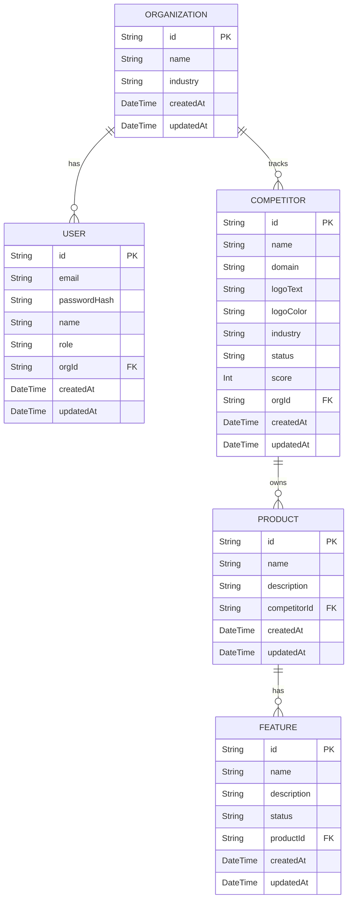

# Database Design: Backend Phase 2

## 1. Entity Relationship Diagram (ERD)

## 2. Entities Detailed Design

### Organization (Existing)
- **Purpose:** Tenant boundary for multi-tenancy.
- **Relationships:** One-to-Many with User, Competitor.

### User (Existing)
- **Purpose:** Authenticated entity.
- **Relationships:** Many-to-One with Organization.

### Competitor
- **Purpose:** Represents a tracked competing company for an organization.
- **Attributes:**
  - `id`: UUID, Primary Key
  - `name`: String, Required
  - `domain`: String, Optional
  - `logoText`: String, Required (For UI placeholders)
  - `logoColor`: String, Required (For UI styling classes)
  - `industry`: String, Optional
  - `status`: String, Required (e.g., Active, Alert)
  - `score`: Integer, Required (Default 0, max 100)
- **Relationships:** 
  - Many-to-One with Organization (`orgId`).
  - One-to-Many with Product.
- **Constraints/Indexes:**
  - Index on `[orgId]` for fast tenant lookups.
  - Index on `[orgId, name]` for search.
- **Cascade Rules:** Deleting an Organization deletes all its Competitors (`onDelete: Cascade`).

### Product
- **Purpose:** Represents a product offered by a Competitor.
- **Attributes:**
  - `id`: UUID, Primary Key
  - `name`: String, Required
  - `description`: String, Optional
- **Relationships:**
  - Many-to-One with Competitor (`competitorId`).
  - One-to-Many with Feature.
- **Constraints/Indexes:**
  - Index on `[competitorId]`.
- **Cascade Rules:** Deleting a Competitor deletes all its Products (`onDelete: Cascade`).

### Feature
- **Purpose:** Represents a specific capability within a Product.
- **Attributes:**
  - `id`: UUID, Primary Key
  - `name`: String, Required
  - `description`: String, Optional
  - `status`: String, Required (e.g., "Available", "Beta", "Missing")
- **Relationships:**
  - Many-to-One with Product (`productId`).
- **Constraints/Indexes:**
  - Index on `[productId]`.
- **Cascade Rules:** Deleting a Product deletes all its Features (`onDelete: Cascade`).

## 3. Future Extensibility
- **Categories:** If needed later, a `Category` entity can be introduced with a Many-to-Many relationship to `Competitor` or `Product`. For now, `industry` string on Competitor suffices.
- **Metrics tracking:** Score is currently static but can be migrated to a time-series model in later phases.
- **Audit Trail (Future Work):** Do not implement in Phase 2. Future support will add `createdBy`, `updatedBy`, `deletedBy` fields to all entities and an `AuditLog` table to record granular system changes.
